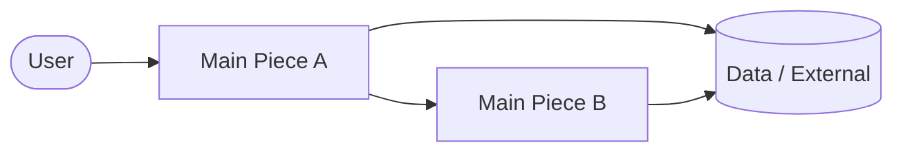

# _Admin Panel_ — Design Brief

> **How to use this**
> Aim for **one page, two max**. If it takes more than an hour to fill or grows
> past two pages, you're overthinking the project — or it's secretly several
> projects. The two sections that matter most are **Problem** (so you don't build
> the wrong thing) and **Non-Goals** (so the scope doesn't quietly grow). If you
> can't fill those two in confidently, you're not ready to start building.
> Keep it alive: update it when reality changes.

| | |
|---|---|
| **Owner** | Z |
| **Status** | Draft |
| **Last updated** | 2026-06-17 |

---

## 1. TL;DR

> _Two or three sentences: what we're building and why. Someone should grasp the
> whole project from this alone. Write it last, once the rest is clear._

---

## 2. Problem & Why Now

> _The most important section. Describe the problem, **not** the solution._
> - Who has this problem?
> - What's the evidence it's real? (support tickets, data, user quotes, lost deals)
> - What happens if we do nothing — and why is now the right time?
>
> If you find yourself describing a feature here instead of a problem, stop —
> that's the warning sign you might be building the wrong thing.

* No standardized UI for Admin panel
* Current implementation is too messy
* Product data still stored locally
* Unable to change page text/data without redeploying
* **No role-based access control** (RBAC) - Single admin role only
* No customer CRUD and progress tracking
* No way of resetting admin panel password
* **No dark mode** - Missing modern UX expectation
* **No keyboard navigation** - Accessibility concern
* No system logging and ability to checking system log
* No performance tracking and display

---

## 3. Goals & Success Metrics

> _What does "this worked" look like? Pick 1–3 measurable signals. If you can't
> name how you'd know it succeeded, you probably can't tell if it's the right
> thing to build._

- **Goal:** _…_
- **We'll know it worked when:** _e.g. X% of users do Y / metric Z moves by N / support tickets about W drop_

#### Fully follow the UI design of template

* **We'll know it worked when:** phase 1 implementation visually similar with template and later on implementation doesn't steer too far away from design document.

#### Data fully migrate to database

* **We'll know it worked when:** frontend fetch text/image from database instead fetch locally (but there will be local backup)

#### Role and user management function as intended

* **We'll know it worked when:** user & role can be CRUD with no bug, user with role can access features that's available to that role

#### Customer progress can be tracked

* **We'll know it worked when:** Customer can be CRUD with proper interface, then the customer journey can be visualized on GUI

---

## 4. Non-Goals (Out of Scope)

> _Your scope-creep firewall. List everything you are **deliberately not doing**
> in this project — including tempting things that feel related. Anything that
> comes up mid-build and isn't a goal above gets parked here, not absorbed into
> the work. Be specific; "we'll keep it simple" is not a non-goal._

- We are **not** _…_
- We are **not** _…_
- Out of scope for now (maybe later): _…_

* We are not making a universal admin panel
* We are not processing payment on this web app
* We do not want too much feature in the current phase of the project
* Out of scope for now (maybe later): Job management functions (kanban and all that)
* Out of scope for now (maybe later): Website performance tracking and visualization

---

## 5. Proposed Approach (The Big Picture)

> _The shape of the solution at a high level — not detailed design. What are the
> main pieces and how do they fit together? A quick diagram often beats
> paragraphs. Keep it conceptual; implementation details live in code / tickets._

- **How it works in a nutshell:** _…_
- **Main building blocks:** _…_

---

## 6. Key Decisions & Trade-offs

> _Only the few decisions that actually matter and would be expensive to reverse.
> For each: what we chose, what we rejected, and why. Skip the obvious ones._

| Decision | We chose | Over | Because |
|----------|----------|------|---------|
| _e.g. Data store_ | _…_ | _…_ | _…_ |
| data store (page text/image) | database | local | allow change without redeployment, allow live update |
| 2FA | include it in scope | implement later | more secure |
| None GDPR data | soft delete | hard delete | easier roll back |
| GDPR data | hard delete | soft delete | policy compliance |

---

## 7. Scope & Milestones

> _Draw the cut line. What's in the first shippable version vs. what's explicitly
> "later"? This is where scope creep usually sneaks in — protect the v1._

- **v1 / Must-have:** _…_
- **Later / Nice-to-have:** _…_
- **Definition of done:** _What has to be true for us to call this shipped._
- **Rough timeline:** _Ballpark only — phases or a target date._

#### Phase 1 - Foundation - UI & Access

- [ ] Remove all previous implementation of admin panel
- [ ] Mention the location of the admin panel template and its design document
- [ ] Overhaul login UI (use "login v1" from the template but without "Continue with Google" and replace account registration with password reset)
- [ ] Overhaul admin panel UI, in current phase it should have no function other than: 
  - [ ] Side bar with fade out text in the middle "Coming Soon" and the user section on the bottom as per the UI template
  - [ ] Top bar with side bar collapse button, UI Preference control button, dark mode button, and user button. GitHub button is not needed. 

- [ ] Wire up authentication and access control where the login detail should fetch from database
- [ ] Create 2FA process with login email (in this case should be )
- [ ] Create password reset process on login page, where a password reset link will be sent to email address and user enter password twice to update the email on the account.
- [ ] User setting page should have password change (input twice, both need to match to change), profile photo change, name & email (view only)

#### Phase 2 - Data migration (image, page data) & data editing interface

- [ ] Create data model for the product data
- [ ] Use product data model to PSQL table on database
- [ ] Migrate product data from local source to database but leave backup method
- [ ] Create data model for the page data
- [ ] Use page data model to PSQL table on database
- [ ] Migrate page data from local source to database but leave backup method
- [ ] Create data model for image storage
- [ ] Use image storage model to PSQL table on database
- [ ] Migrate image from local source to database but leave backup method
- [ ] Create image storage CRUD UI
- [ ] Create product data CRUD UI
- [ ] Create page data CRUD UI

#### Phase 3 - User and Role management

- [ ] User CRUD following the template layout but fully wired
- [ ] Role management following the template layout but fully wired

#### Phase 4 - Customer management

- [ ] Customer CRUD with UI
- [ ] Online submissions CRUD with UI
- [ ] Customer CRUD should have progress tracking what payment and the amount they made

P.S. Current RBAC plan

| Role       | Pages | Gallery | Customer    | Redirects | Users |
| ---------- | ----- | ------- | ----------- | --------- | ----- |
| **Admin**  | CRUD  | CRUD    | Read/Export | CRUD      | CRUD  |
| **Editor** | CRUD  | CRUD    | Read        | Read      | -     |
| **Viewer** | Read  | Read    | Read        | Read      | -     |

---

## 8. Risks & Open Questions

> _Known unknowns to resolve, ideally early. Also a parking lot for "maybe later"
> ideas so they're captured without expanding the current scope._

- **Risk / unknown:** _… → how we'll address or de-risk it_
- **Open question:** _… → who decides, by when_
- **Parking lot (revisit after launch):** _…_

---

> _Tip: review this brief at the start of the project and skim it whenever a new
> idea threatens to grow the scope. "Is this a goal, or does it belong in
> Non-Goals / parking lot?" is the question that keeps projects on the rails._
