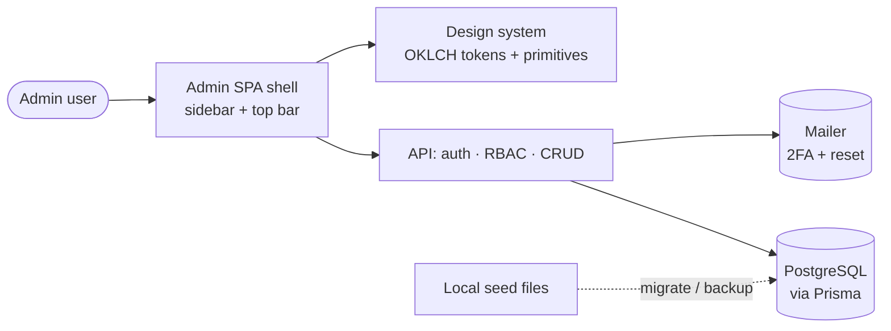

# _Admin Panel_ — Design Brief

> **How to use this**
> Aim for **one page, two max**. If it takes more than an hour to fill or grows
> past two pages, you're overthinking the project — or it's secretly several
> projects. The two sections that matter most are **Problem** (so you don't build
> the wrong thing) and **Non-Goals** (so the scope doesn't quietly grow). If you
> can't fill those two in confidently, you're not ready to start building.
> Keep it alive: update it when reality changes.

| | |
|---|---|
| **Owner** | Z |
| **Status** | Ready for review |
| **Last updated** | 2026-06-18 |

---

## 1. TL;DR

> _Two or three sentences: what we're building and why. Someone should grasp the
> whole project from this alone. Write it last, once the rest is clear._

We're rebuilding the admin panel from scratch inside the existing React/Vite app, adopting the Studio Admin template's design system (OKLCH tokens + shadcn-style primitives) for a clean, accessible UI with dark mode. The RBAC, audit-log, and refresh-token models already exist from feature 006, so we wire them up, move site content and images out of hardcoded files into the database (keeping local backups), and add secure login (2FA + password reset), user/role management, and customer progress tracking. It ships in four sequential, independently shippable phases, starting with login and the app shell.

---

## 2. Problem & Why Now

> _The most important section. Describe the problem, **not** the solution._
> - Who has this problem?
> - What's the evidence it's real? (support tickets, data, user quotes, lost deals)
> - What happens if we do nothing — and why is now the right time?
>
> If you find yourself describing a feature here instead of a problem, stop —
> that's the warning sign you might be building the wrong thing.

* No standardized UI for Admin panel
* Current implementation is too messy
* Product data still stored locally
* Unable to change page text/data without redeploying
* **No role-based access control** (RBAC) - Single admin role only
* No customer CRUD and progress tracking
* No way of resetting admin panel password
* **No dark mode** - Missing modern UX expectation
* **No keyboard navigation** - Accessibility concern
* No system logging and ability to checking system log
* No performance tracking and display

---

## 3. Goals & Success Metrics

> _What does "this worked" look like? Pick 1–3 measurable signals. If you can't
> name how you'd know it succeeded, you probably can't tell if it's the right
> thing to build._

#### Fully follow the UI design of template

* **We'll know it worked when:** phase 1 implementation visually similar with template and later on implementation doesn't steer too far away from design document.

#### Data fully migrate to database

* **We'll know it worked when:** frontend fetch text/image from database instead fetch locally (but there will be local backup)

#### Role and user management function as intended

* **We'll know it worked when:** user & role can be CRUD with no bug, user with role can access features that's available to that role

#### Customer progress can be tracked

* **We'll know it worked when:** Customer can be CRUD with proper interface, then the customer journey can be visualized on GUI

---

## 4. Non-Goals (Out of Scope)

> _Your scope-creep firewall. List everything you are **deliberately not doing**
> in this project — including tempting things that feel related. Anything that
> comes up mid-build and isn't a goal above gets parked here, not absorbed into
> the work. Be specific; "we'll keep it simple" is not a non-goal._

* We are not making a universal admin panel
* We are not processing payment on this web app
* We do not want too much feature in the current phase of the project
* Out of scope for now (maybe later): Job management functions (kanban and all that)
* Out of scope for now (maybe later): Website performance tracking and visualization

---

## 5. Proposed Approach (The Big Picture)

> _The shape of the solution at a high level — not detailed design. What are the
> main pieces and how do they fit together? A quick diagram often beats
> paragraphs. Keep it conceptual; implementation details live in code / tickets._

- **How it works in a nutshell:** The admin panel is a **client-only** section of the existing React/Vite SPA (no SSR/SEO needed), styled by porting the template's Tailwind/OKLCH tokens and shadcn-style primitives into a dedicated admin UI layer. It talks to the existing Express + Prisma API, which already models users, RBAC, audit logs, refresh-token rotation, settings, and customers. Site content and images move from hardcoded TypeScript files into Postgres, with the original files kept as a backup/seed source.
- **Main building blocks:**
  - **Admin shell** — collapsible sidebar + 48px top bar (collapse · preferences · dark-mode · account); built once, reused by every page (SRP).
  - **Design-system layer** — OKLCH tokens + shadcn-style primitives (Button, Input, Card, Table, Sidebar…), kept separate from the public `@modular-house/ui` marketing components (high cohesion, loose coupling).
  - **Auth & RBAC** — login, email 2FA, password reset, refresh-token rotation, and a `requirePermission` middleware driven by the existing Role/Permission tables.
  - **Content & media** — DB-backed CRUD for pages, products, and images; local seed files retained as backup.
  - **Customer tracking** — CRUD + progress/payment timeline over the existing Customer/Note models.
- **How we'll build it:** requirements → architecture → constrained implementation → automated tests → system validation → iterate, **per phase** (make it work, then right, then fast).

---

## 6. Key Decisions & Trade-offs

> _Only the few decisions that actually matter and would be expensive to reverse.
> For each: what we chose, what we rejected, and why. Skip the obvious ones._

| Decision | We chose | Over | Because |
|----------|----------|------|---------|
| UI framework | Keep React/Vite and **port** the template's tokens + shadcn-style primitives | Migrating the app to Next.js | Re-platforming is high-risk and out of scope; the design is portable, the framework rewrite isn't worth it |
| Admin rendering | Client-only SPA section (no SSR/prerender) | SSR like the public site | Admin needs no SEO; CSR isolates the design-system port and keeps it simple (KISS) |
| Theming scope | Ship **Default preset + light/dark + one font** | All 4 presets × 18 fonts | YAGNI — tokens still allow adding presets later without rework |
| Auth & RBAC backend | **Reuse** the existing 006 schema (Role/Permission, RefreshToken rotation, AuditLog, lockout) | Build a fresh auth/RBAC layer | DRY — already modeled and migrated; wire it up rather than rebuild |
| Access checks | Permission-based `requirePermission` middleware | Hardcoded role-string checks | Matches the RBAC matrix; adding a role never means editing route code |
| data store (page text/image) | database | local | allow change without redeployment, allow live update |
| 2FA | include it in scope | implement later | more secure |
| 2FA / reset delivery | reuse the existing SMTP mailer (nodemailer) to email a one-time code / reset link | add a new OTP/email provider or authenticator-app TOTP | no new dependency or vendor; the transactional mailer already pools + retries (KISS / DRY) |
| `super_admin` account | show it but **read-only** in the panel — editable only via direct DB access | edit it like any other user | protects the break-glass account from accidental lockout or privilege change; `super_admin` keeps unrestricted access |
| None GDPR data | soft delete | hard delete | easier roll back |
| GDPR data | hard delete | soft delete | policy compliance |

---

## 7. Scope & Milestones

> _Draw the cut line. What's in the first shippable version vs. what's explicitly
> "later"? This is where scope creep usually sneaks in — protect the v1._

- **v1 / Must-have:** Phase 1 only — secure login (2FA + password reset), the app shell (sidebar + top bar), wired auth/access control, and the user-settings page. The content area shows "Coming Soon".
- **Later / Nice-to-have:** Phases 2–4 — content/media migration + editors, user/role management, customer tracking. Each phase is independently shippable.
- **Definition of done:** Old admin removed; new shell + login match the template visually and meet WCAG 2.1 AA; auth/2FA/reset work against the database; dark mode + keyboard nav functional; automated tests green; no regression on the public site.
- **Rough timeline:** Sequential phases, each gated by its own tests + validation before the next begins.

#### Phase 1 - Foundation - UI & Access

- [ ] Remove all previous implementation of admin panel
- [ ] Mention the location of the admin panel template and its design document
- [ ] Overhaul login UI (use "login v1" from the template but without "Continue with Google" and replace account registration with password reset)
- [ ] Overhaul admin panel UI, in current phase it should have no function other than: 
  - [ ] Side bar with fade out text in the middle "Coming Soon" and the user section on the bottom as per the UI template
  - [ ] Top bar with side bar collapse button, UI Preference control button, dark mode button, and user button. GitHub button is not needed. 

- [ ] Wire up authentication and access control where the login detail should fetch from database
- [ ] Create 2FA process: a one-time code emailed to the account address on each login, sent through the existing SMTP mail service (the only new work is generating, storing, and verifying a short-lived code — delivery reuses the current mailer)
- [ ] Create password reset process on login page, where a password reset link is sent to the email address and the user enters the new password twice (both must match) to update the password on the account
- [ ] User setting page should have password change (input twice, both need to match to change), profile photo change, name & email (view only)

#### Phase 2 - Data migration (image, page data) & data editing interface

- [ ] Create data model for the product data
- [ ] Use product data model to PSQL table on database
- [ ] Migrate product data from local source to database but leave backup method
- [ ] Create data model for the page data
- [ ] Use page data model to PSQL table on database
- [ ] Migrate page data from local source to database but leave backup method
- [ ] Create data model for image storage
- [ ] Use image storage model to PSQL table on database
- [ ] Migrate image from local source to database but leave backup method
- [ ] Create image storage CRUD UI
- [ ] Create product data CRUD UI
- [ ] Create page data CRUD UI

#### Phase 3 - User and Role management

- [ ] User CRUD following the template layout but fully wired
- [ ] Role management following the template layout but fully wired

#### Phase 4 - Customer management

- [ ] Customer CRUD with UI
- [ ] Online submissions CRUD with UI
- [ ] Customer CRUD should have progress tracking what payment and the amount they made

**RBAC matrix** (CRUD = create/read/update/delete; `-` = no access)

| Role            | Pages | Gallery | Customer    | Redirects | Users | Roles |
| --------------- | ----- | ------- | ----------- | --------- | ----- | ----- |
| **Super Admin** | CRUD  | CRUD    | CRUD/Export | CRUD      | CRUD  | CRUD  |
| **Admin**       | CRUD  | CRUD    | CRU         | CRUD      | CRUD¹ | Read  |
| **Editor**      | CRUD  | CRUD    | Read        | Read      | -     | -     |
| **Viewer**      | Read  | Read    | Read        | Read      | -     | -     |

- **Super Admin** has unrestricted access to every feature. Its own account is **shown read-only** in the panel and can only be changed via direct database access (the break-glass account).
- ¹ **Admin** can manage Editor/Viewer users but cannot create, edit, or delete a Super Admin, and cannot change role↔permission definitions (Roles = Read). Any further Admin limitations are settled per-feature as the phases land.

---

## 8. Risks & Open Questions

> _Known unknowns to resolve, ideally early. Also a parking lot for "maybe later"
> ideas so they're captured without expanding the current scope._

- **Risk — design-system port:** the template is Tailwind v4 / Next.js; the Vite app's setup differs → de-risk with a short spike that stands up the tokens + 3–4 primitives before committing.
- **Risk — theme flash (FOUC):** admin is client-rendered → apply the template's boot-script pattern so the theme is set before first paint.
- **Risk — 2FA & reset depend on email delivery:** both reuse the existing SMTP `mailer` service; login OTPs are time-sensitive, so gate Phase 1 sign-off on a verified real send with acceptable delivery latency.
- **Risk — migration reversibility:** keep the current TS seed files as backup and make migrations idempotent so we can re-run or roll back.
- **Resolved — 2FA / reset delivery:** use the existing SMTP mailer (nodemailer); no new email provider or vendor.
- **Resolved — `super_admin`:** displayed but read-only in the panel (DB-only edits); retains access to everything.
- **Open question — Admin's exact limits** vs. Super Admin, beyond "can't touch Super Admin / can't redefine roles" → owner: Z, settled as Phase 3 lands.
- **Parking lot (revisit after launch):** system/audit-log viewer (AuditLog already exists), extra theme presets, job kanban, website performance tracking, multi-language content.

---

> _Tip: review this brief at the start of the project and skim it whenever a new
> idea threatens to grow the scope. "Is this a goal, or does it belong in
> Non-Goals / parking lot?" is the question that keeps projects on the rails._
