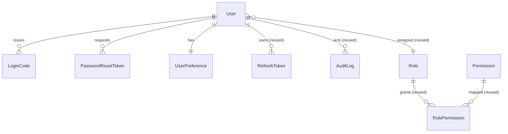

# Phase 1 Data Model: Admin Panel — Phase 1 (UI & Access)

**Feature**: `012-panel-phase-1` | **Date**: 2026-06-23

Reused models (`User`, `Role`, `Permission`, `RolePermission`, `RefreshToken`, `AuditLog`,
`Setting`) are unchanged except for the additive `User` extension below. This phase adds three new
tables. All new structures are designed to extend, not break, the feature-006 schema (Open-Closed).

---

## 1. Entity: `User` (extended — additive only)

New nullable fields (no data migration required; existing rows default to `NULL`):

| Field | Type | Constraints | Notes |
|-------|------|-------------|-------|
| `displayName` | `String?` | `@map("display_name") @db.VarChar(100)` | Shown in sidebar user section + settings; read-only in Phase 1 |
| `profilePhoto` | `Bytes?` | `@map("profile_photo")` | Raw image bytes; `NULL` → initials fallback (G4) |
| `profilePhotoMime` | `String?` | `@map("profile_photo_mime") @db.VarChar(50)` | One of `image/png`, `image/jpeg`, `image/webp` (G1) |

New relations:

- `loginCodes LoginCode[]`
- `passwordResetTokens PasswordResetToken[]`
- `preference UserPreference?`

**Validation rules**: `profilePhotoMime` must be set iff `profilePhoto` is set (enforced in service,
not DB). Photo bytes length <= 5 MB (G2, enforced at upload).

---

## 2. Entity: `LoginCode` (new — two-factor OTP)

| Field | Type | Constraints | Notes |
|-------|------|-------------|-------|
| `id` | `String` | `@id @default(uuid()) @db.Uuid` | |
| `userId` | `String` | `@map("user_id") @db.Uuid`, FK → `User.id` | |
| `challengeId` | `String` | `@map("challenge_id")` | opaque CSPRNG id returned by `login`; binds the code-entry step to the user without exposing the email; shared across resends within one challenge (B9) |
| `codeHash` | `String` | `@map("code_hash")` | argon2 hash of the 6-digit code (B2); raw never stored |
| `expiresAt` | `DateTime` | `@map("expires_at") @db.Timestamptz(6)` | `issuedAt + 10m` (B3) |
| `attemptCount` | `Int` | `@default(0) @map("attempt_count")` | wrong-guess counter; invalidate at 5 (B5) |
| `consumedAt` | `DateTime?` | `@map("consumed_at") @db.Timestamptz(6)` | set on first success; single-use (B4) |
| `createdAt` | `DateTime` | `@default(now()) @map("created_at") @db.Timestamptz(6)` | |

Relations: `user User @relation(fields: [userId], references: [id], onDelete: Cascade)`

Indexes: `@@index([userId])`, `@@index([challengeId])`, `@@index([expiresAt])`. Table map: `@@map("login_codes")`.

**State**: `active` (`consumedAt = null`, `now < expiresAt`, `attemptCount < 5`) → `consumed`
(success) | `expired` (TTL) | `locked` (`attemptCount >= 5`) | `superseded` (newer code issued, B6).
Issuing a new code marks prior active codes for the user consumed/invalid (B6). A `resend-code`
reuses the same `challengeId` on the new code row so the client's code-entry step stays bound to the
original challenge (B9).

---

## 3. Entity: `PasswordResetToken` (new)

| Field | Type | Constraints | Notes |
|-------|------|-------------|-------|
| `id` | `String` | `@id @default(uuid()) @db.Uuid` | |
| `userId` | `String` | `@map("user_id") @db.Uuid`, FK → `User.id` | |
| `tokenHash` | `String` | `@map("token_hash")` | SHA-256 hash of the 32-byte token (C1); raw never stored |
| `expiresAt` | `DateTime` | `@map("expires_at") @db.Timestamptz(6)` | `issuedAt + 60m` (C2) |
| `consumedAt` | `DateTime?` | `@map("consumed_at") @db.Timestamptz(6)` | set on success; single-use (C3) |
| `createdAt` | `DateTime` | `@default(now()) @map("created_at") @db.Timestamptz(6)` | |

Relations: `user User @relation(fields: [userId], references: [id], onDelete: Cascade)`

Indexes: `@@index([userId])`, `@@index([tokenHash])`, `@@index([expiresAt])`. Map:
`@@map("password_reset_tokens")`.

**State**: `active` → `consumed` (success) | `expired` (TTL). Reused/expired link surfaces a clear
error + path to request a new one (C3). Successful consume triggers lockout-clear (C5) +
account-wide refresh revoke (C6).

---

## 4. Entity: `UserPreference` (new — per-user UI state)

| Field | Type | Constraints | Notes |
|-------|------|-------------|-------|
| `id` | `String` | `@id @default(uuid()) @db.Uuid` | |
| `userId` | `String` | `@unique @map("user_id") @db.Uuid`, FK → `User.id` | one row per user |
| `themeMode` | `String` | `@default("system") @map("theme_mode") @db.VarChar(10)` | `light` \| `dark` \| `system` (H1) |
| `sidebarCollapsed` | `Boolean` | `@default(false) @map("sidebar_collapsed")` | persisted collapse state (H2) |
| `createdAt` | `DateTime` | `@default(now()) @map("created_at") @db.Timestamptz(6)` | |
| `updatedAt` | `DateTime` | `@updatedAt @map("updated_at") @db.Timestamptz(6)` | |

Relations: `user User @relation(fields: [userId], references: [id], onDelete: Cascade)`

Index: `@@unique([userId])` (implicit). Map: `@@map("user_preferences")`.

**Validation**: `themeMode` constrained to the three literals in the service layer (Zod enum).

---

## 5. Reused entities (no schema change)

| Entity | Phase 1 use |
|--------|-------------|
| `Role` / `Permission` / `RolePermission` | Drive `requirePermission`; effective permissions loaded into the access token (FR-036) |
| `RefreshToken` | In-memory access token's renewal; family rotation + theft detection; account-wide revoke (E3–E6); `lastUsedAt DateTime?` confirmed present (added additively in the `add_login_2fa_reset_and_profile` migration, T008) and checked to enforce the 30m idle timeout (E7) |
| `AuditLog` | Records the I1 event set (FR-037) |
| `Setting` | Untouched (global config); per-user UI state goes to `UserPreference`, not here |

---

## 6. Relationships (new)

---

## 7. Migration

- **Name**: `add_login_2fa_reset_and_profile`
- **Direction**: forward, additive. Adds three tables (`login_codes`, `password_reset_tokens`,
  `user_preferences`), three nullable columns on `users` (`display_name`, `profile_photo`,
  `profile_photo_mime`), and one nullable column on `refresh_tokens` (`last_used_at`, for the E7
  idle timeout — T008). No column drops, no type changes, no backfill.
- **Reversibility**: drop the three new tables, the three new `users` columns, and the
  `refresh_tokens.last_used_at` column. Existing rows are unaffected because all additions are
  nullable/defaulted.
- **Seed**: extend `prisma/seed.ts` to set `displayName` on the bootstrapped `super_admin`/admin
  account(s) and ensure the Phase 1 permission rows exist. Seed remains idempotent (upsert).

---

## 8. Field-level validation summary (single source: plan §2)

| Rule | Where enforced | Spec ref |
|------|----------------|----------|
| OTP `/^\d{6}$/`, hashed, 10m TTL, single-use, 5-attempt cap | `LoginCodeService` | B1–B6 |
| Reset token 32-byte, SHA-256 hashed, 60m TTL, single-use | `PasswordResetTokenService` | C1–C3 |
| Password min 12 / max 128 / lower+upper+digit / != current / entries match | `passwordPolicy` | D1–D5 |
| Photo MIME in {png,jpeg,webp}, <= 5 MB | `settings` route (multer) | G1–G3 |
| `themeMode` in {light,dark,system} | `userPreference` service | H1 |
| Lockout 5 fails / 15m; reset clears lockout | `AuthService` | A2,A3,C5 |
| `challengeId` opaque, resolves to user, stable across resends | `LoginCodeService` | B9 |
| Idle timeout 30m via `lastUsedAt`; absolute cap 7d | `AuthService` (refresh) | E7 |
